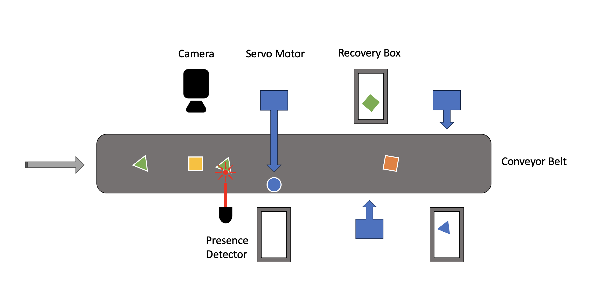
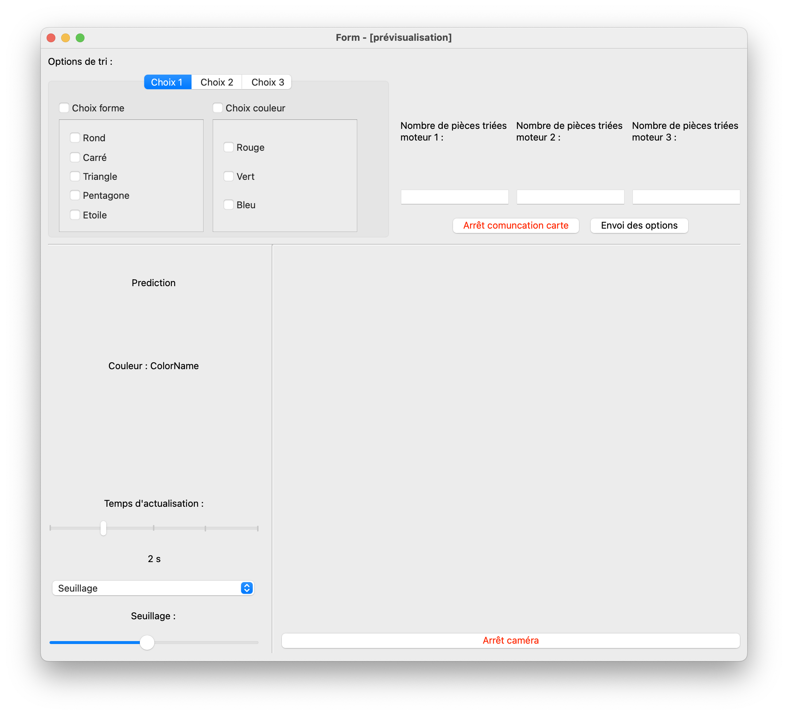
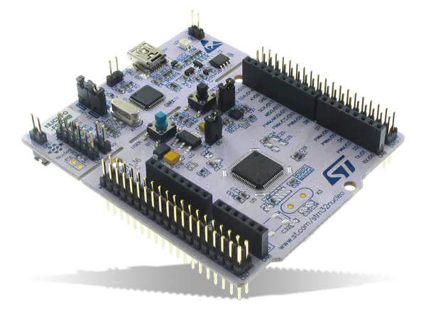

.. Industrial_Vision documentation master file, created by
   sphinx-quickstart on Sun Jun 18 18:58:23 2023.
   You can adapt this file completely to your liking, but it should at least
   contain the root `toctree` directive.

Welcome to Industrial_Vision's documentation!
=============================================

.. image:: https://img.shields.io/badge/python-3776AB?style=for-the-badge&logo=python&logoColor=white

.. image:: https://img.shields.io/badge/C++-00599C?style=for-the-badge&logo=cplusplus&logoColor=white

.. caution::
   This website is still a work in progress

Welcome to Industrial_Vision, a Python-based project that combines computer vision, 
artificial intelligence, and servo motors to automate a sorting process 
based on shape recognition !

With a camera positioned above a conveyor belt, the system captures multiple images 
and utilizes a live feed to recognizes shapes with a pretrained AI model. 
The sorted objects are then directed to appropriate 
locations using servo motors, providing an efficient and streamlined sorting solution.

Project Overview 
----------------

With Industrial_Vision, the primary objective is to develop a practical system that 
can accurately identify and sort objects based on their shapes and their color. 

The system user has access to an UI to select different system parameters such as different 
sorting options, different camera preprocessing options.

Shape recognition is achived by implementing a camera system above a conveyor belt to capture images of 
objects passing through. The images are then processed using computer vision techniques,
and the extracted features are fed into an AI model for shape recognition and color recognition.

.. seealso::

   .. py:class:: Industrial_Vision() 
      :noindex:
      
      :octicon:`device-camera-video` Documentation of the :py:class:`Industrial_Vision()` module. 

To train the AI model, we use the scikit-learn library in Python, we also developed the training algorithm
for the AI model.

.. seealso::

   .. py:class:: IA_training() 
      :noindex:
      
      :octicon:`rocket` Documentation of the :py:class:`IA_training()` module. 

To generate a database for training the AI model, we have implemented code that
captures images of objects as they move along the conveyor belt. These images 
are labeled according to their corresponding shapes, creating a diverse dataset
that enables the AI model to learn and classify shapes effectively.

.. seealso:: 

   .. py:class:: Create_DDB() 
      :noindex:
      
      :octicon:`database` Documentation of the :py:class:`Create_DDB` module. 

Once the AI model identifies the shape and the color of an object, it sends a signal to a Nucleo STM32 card (coded in `C++` via `Keil studio <https://studio.keil.arm.com/>`_)
to trigger the servo motors integrated into the conveyor belt system.

Finally this is how the objects arriving on the conveyor belt are sorted !

.. toctree::
   :maxdepth: 2
   :caption: Contents:
   
   
   Usage

   about_the_project
   
   modules

Indices and tables
==================

* :ref:`genindex`
* :ref:`modindex`

